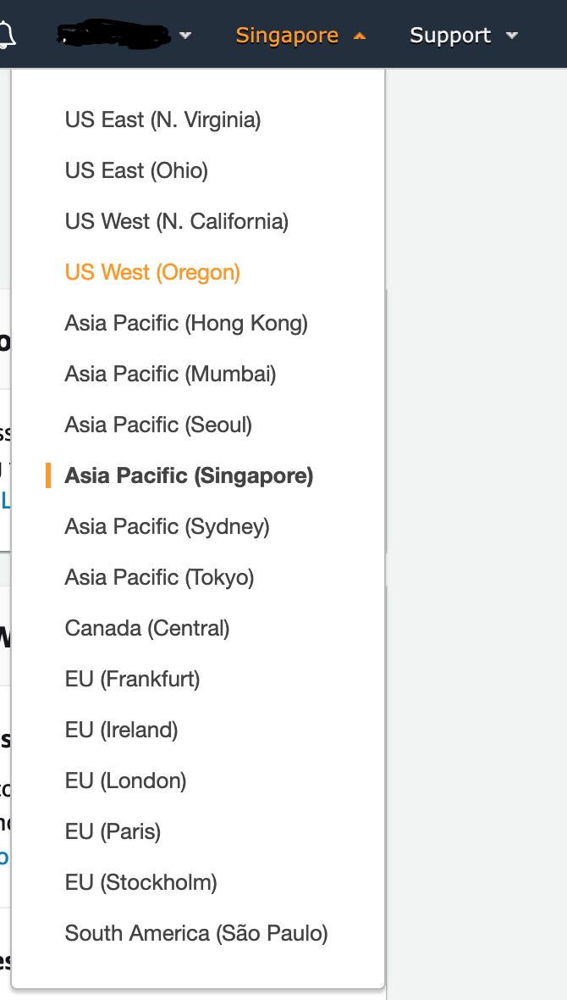
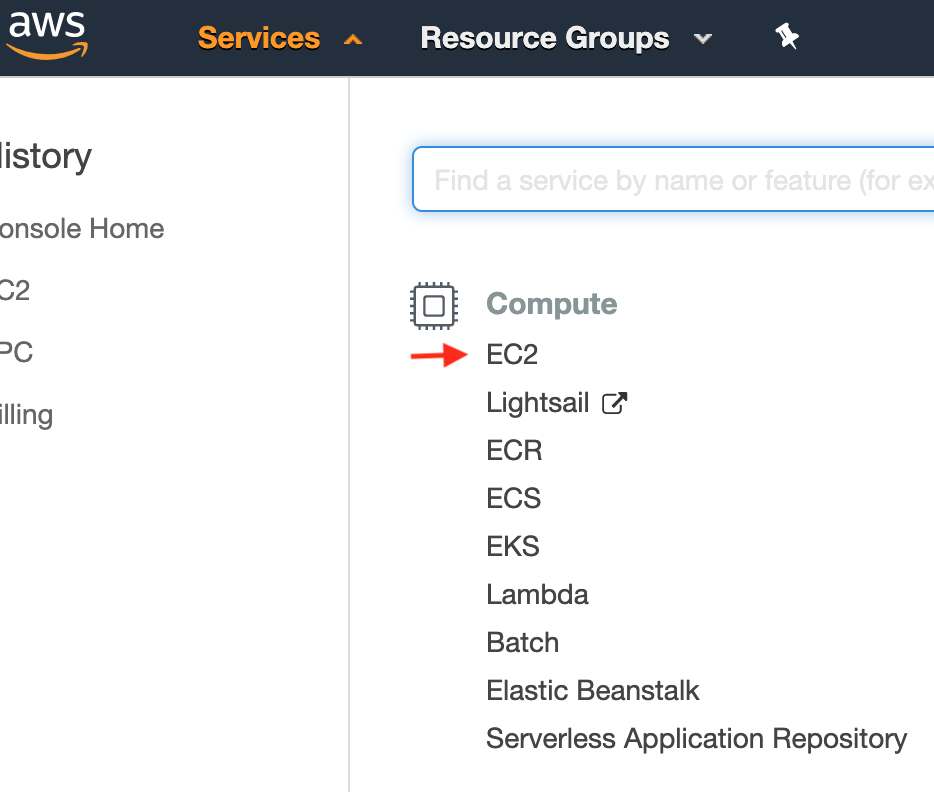
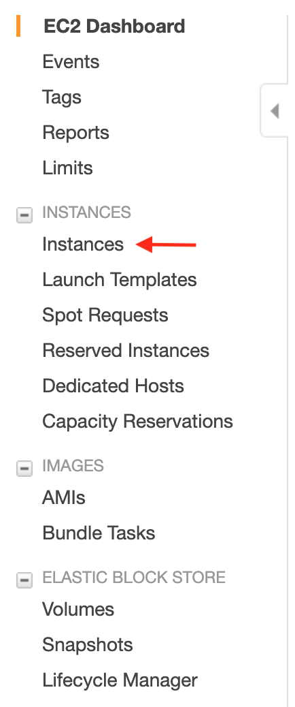
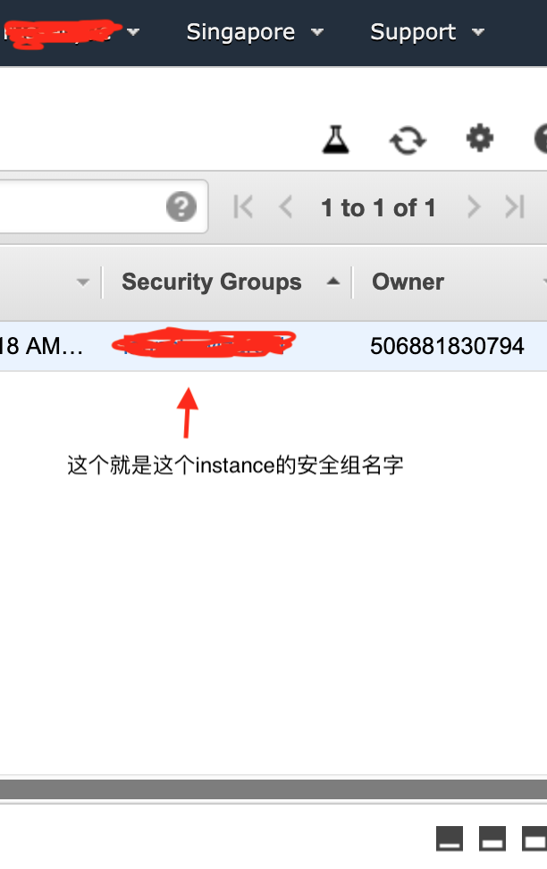
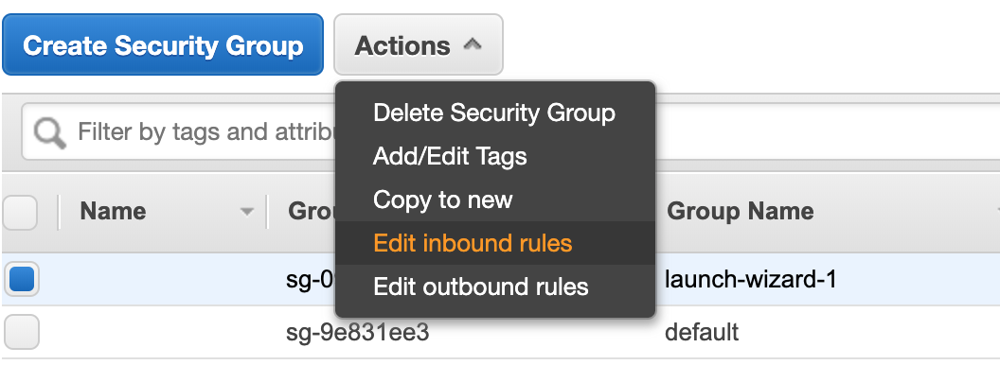
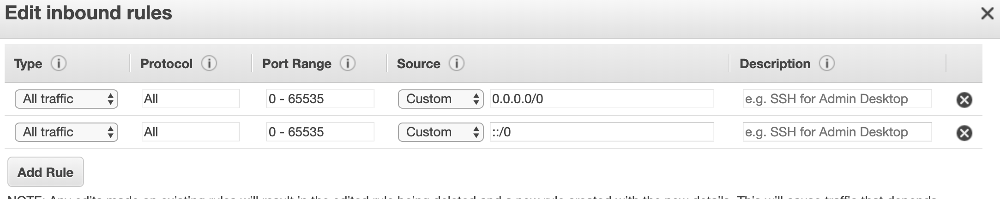
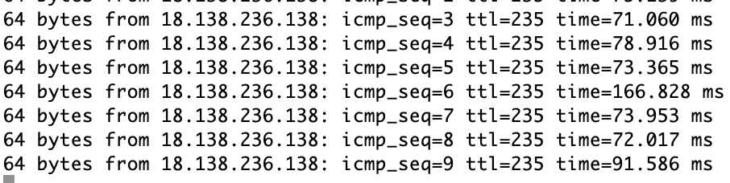
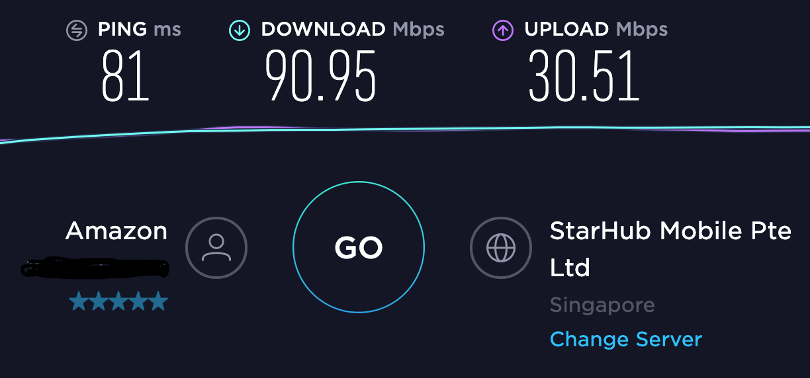

# shadowsocks-aws-tutorial

原先使用某个 vpn 公司的服务进行翻墙。但是因为 vpn 公司的网络都是共享的，很多时候会出现卡顿和不稳定，便决定自己搭建一个服务器拿来做代理。
当上网搜索了一阵子之后，总算在几个小时内就把自己的代理做出来了。
我使用的是 aws 的 vps，因为现在 amazon 有给一年的免费试用。
让我们开始吧。

> vps 是 Virtual private server 的缩写，详细查看这里：[https://en.wikipedia.org/wiki/Virtual_private_server](https://en.wikipedia.org/wiki/Virtual_private_server)

## 第一步：注册 aws 账号

进入 [https://aws.amazon.com/](https://aws.amazon.com/)，点击右上角的 create account，跟着一步一步走就可以。

## 第二步：创建 vps instance

在完成注册之后，可以进入 AWS Management Console，然后记得要先在右上角选择你要部署的服务器的区域，如下图：



如上，我选择的是新加坡的，你也可以选择亚洲的其它国家，这样做是为了提高速度和降低 ip 被墙的可能性。

之后便点击左上角的 services 下拉选择 ec2



然后在打开的页面的左侧导航栏选择 instances



之后点击左上角的 Launch Instance 去创建 vps instance， 跟着走就好。

## 第三步：设置安全组

每个 vps instance 都会属于一个安全组，安全组里面定义了进出服务器的端口规则，没有设置安全组的话，就只有默认地可以通过 ssh 连接服务器的 22 的端口而已。所以我们可以做一个简单的设置去开放 vps instance 的所有端口。

首先先查看你的 instance 属于什么安全组，可以在刚才的 instance 页面拉到最右端查看。



然后在左边的导航栏选择 Security Group

再点击选择修改 instance 所属安全组规则的 inbound rule（端口进入规则）：



修改成如下：



## 第三步：连接到 instance

点击左侧导航栏的 Instances 回到刚才的 instances 页面，然后点击 Connect, 你便会看到如何连接到 instance。

你可以先试着 ping 一下服务器
```bash
$ ping your-instance-address(服务器地址)
```

顺便提醒一下，如果刚才我们没有设置安全组规则，这里是 ping 不进去的。

如果 ping 有反应的话，如下：



那么我们就可以继续操作了，要不然就说明这个 ip 被墙了，需要你去更换 instance 的 ip。

那么让我们开始通过 ssh 连接到 instance。
在创建 instance 的时候，aws 让你创建 一个 keypair，并且会自动下载一对钥匙下来（后缀为 .pem）的文件

假设你的 keypair 文件的名字就叫 keypair.pem

那么到你的 keypair.pem 的文件所在目录运行如下命令就可：

```bash
$ chmod 400 keypair.pem
$ ssh -i "keypair.pem" your-instance-address(服务器地址)
```
那么你就连接到你的 instance 了

## 第四步：安装 EPEL

在 aws instance 上安装 shadowsocks 之前我们要先安装 EPEL，运行如下命令就可：

```bash
[ec2-user ~]$ sudo yum install https://dl.fedoraproject.org/pub/epel/epel-release-latest-7.noarch.rpm
```

## 第五步： 在 instance 上安装 shadowsocks

感谢 [@teddysun](https://github.com/teddysun) 大佬制作的一键安装脚本(下面的命令目前还可以使用，但是由于大佬的退出, 版本已经不再更新)

```bash
$ wget --no-check-certificate -O shadowsocks-all.sh https://raw.githubusercontent.com/teddysun/shadowsocks_install/master/shadowsocks-all.sh
$ chmod +x shadowsocks-all.sh
$ sudo ./shadowsocks-all.sh 2>&1 | tee shadowsocks-all.log
```
执行完毕之后，你的 shadowsocks 就设置完毕了，但是记住把最后打印出来的信息保存下来。

> 对于 teddysun 编写的 shell 文件感兴趣的可以点击这里：[shadowsocks-all.sh](shell/shadowsocks-all.sh)

## 第六步：安装 shadowsocks 客户端

### Mac
在 Mac 上安装 shadowsocks 客户端很简单

到 [https://github.com/shadowsocks/ShadowsocksX-NG/releases](https://github.com/shadowsocks/ShadowsocksX-NG/releases) 下载即可。

值得注意的是，打开下载来的软件 ShadowsocksX-NG ( Mac 版本) 没有实际的软件界面，一切操作都在顶部导航栏。

### iPhone

在 iPhone 上可以安装 Potatso Lite，但是国内的 apple id 账号下载不了，你可以去注册一个国外的 apple id 账号然后进行下载，具体操作可以 google 或者百度。

## 测试速度

连接了之后，你可以上 [https://www.speedtest.net](https://www.speedtest.net) 测试一下速度



这是我的速度测试。我家里使用的是 100Mbps 的网络，所以这个连接速度基本上就等同于我家网络的带宽速度。因为家里网络离代理服务器较远的原因，ping 值有点高。

